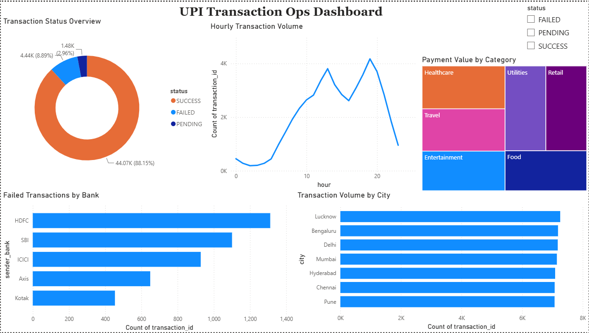
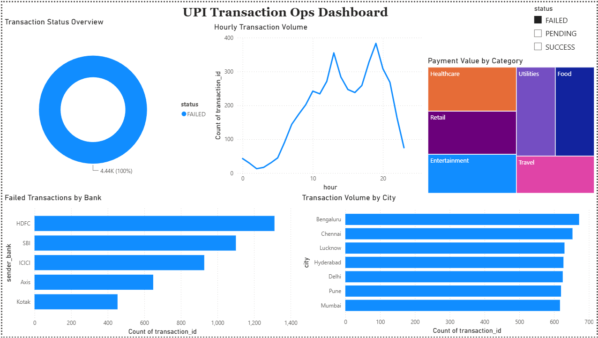
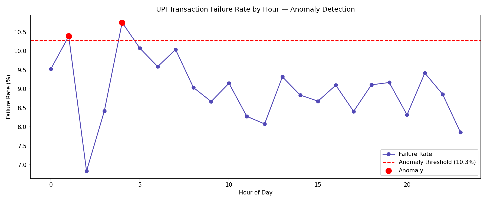

# UPI Transaction Anomaly & Ops Dashboard

> An end to end data pipeline that helps fintech ops teams monitor 
> UPI payment health, identify failing corridors, and automatically 
> flag anomalous failure rate spikes , before they escalate.

---

## The Problem

Fintech companies like Razorpay, PhonePe, and Paytm process crores 
of UPI transactions daily. When failure rates spike, ops teams find 
out too late , after customer complaints roll in. Most teams still 
query databases manually to answer basic questions like:

- Which bank is causing the most failures right now?
- Is the 4am failure spike normal or an anomaly?
- Which merchant category is losing the most revenue to failed payments?

This project answers all of these automatically.

---

## What This Project Does

| Component | Description |
|---|---|
| Synthetic Dataset | 50,000 realistic UPI transactions with time of day patterns |
| SQL Analysis | 3 analytical queries on failure rates, revenue at risk, peak hours |
| Anomaly Detection | Statistical threshold model that flags abnormal failure hours |
| Power BI Dashboard | 5 interactive visuals with status slicer for live filtering |

---

## Key Findings

- **ICICI Bank** has the highest failure rate at **9.12%**
- **1am and 4am** are anomalous hours , failure rate crosses 10.3% threshold
- **Healthcare** category has the highest revenue at risk ; ₹12.3L in failed transactions
- **Evening peak (7pm–8pm)** drives the highest transaction volume

---

## Dashboard Preview



*Click FAILED on the slicer , all 5 visuals update simultaneously*



---

## Anomaly Detection



Hours 1am and 4am flagged as anomalous using a 
mean + 1.5σ statistical threshold on hourly failure rates.

---

## Project Structure

```
upi-transaction-ops-dashboard/
├── UPI_Transaction_Anomaly_&_Ops.ipynb
├── upi_ops_dashboard.pbix
├── anomaly_detection.png
├── dashboard_overview.png
├── dashboard_failed_filter.png
└── README.md
```

---

## Tech Stack

- **Python** : pandas, matplotlib, sqlite3
- **SQL** : SQLite for analytical queries
- **Power BI Desktop** : interactive ops dashboard

---

## How to Run

1. Open `UPI_Transaction_Anomaly_&_Ops.ipynb` in Google Colab
2. Run all cells : generates dataset, runs SQL, produces anomaly plot
3. Open `upi_ops_dashboard.pbix` in Power BI Desktop
4. Use the status slicer to filter by SUCCESS / FAILED / PENDING

---

## Business Impact

If ops teams catch a failure spike 30 minutes earlier using this 
dashboard, and average failed transaction value is ₹1,500 
even 100 recovered transactions = **₹1.5L saved per incident.**

---

Built by Namrata Singh | www.linkedin.com/in/namrata-singh-3658b0287
